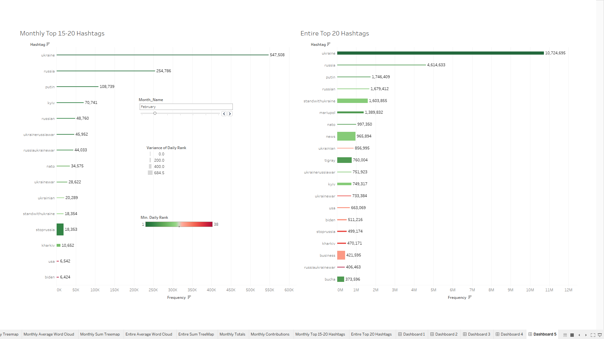
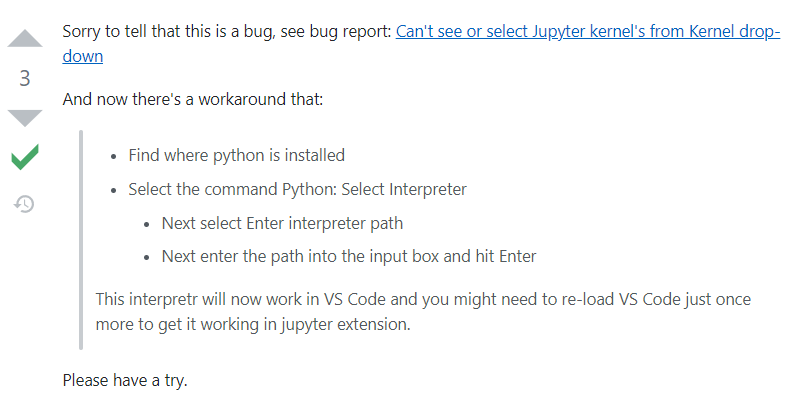

# ukraine-conflict-hashtags
Big Data solution for chosen Social Media-themed topic as part of SENG8080-Case-Studies course

# Dataset

Version 119 of
https://www.kaggle.com/datasets/bwandowando/ukraine-russian-crisis-twitter-dataset-1-2-m-rows

# Setup
 
`git clone` this repo, `cd` into it.

Download the dataset into a folder named `data/` (create this). You should get a 9GB+ file called archive.zip.

Unzip the archive.zip, then the .gzips to end up with a list of .csvs (you can select them all and use 7zip on Windows).

Delete unneeded zips.

Open the folder in VS Code.

Open a (powershell) terminal and run the following commands:

`virtualenv venv` - create a virtual environment, (install virtualenv if you don't have it)

`.venv\Scripts\activate` (Windows) or `source .venv/bin/activate` (Linux) - activate the virtual environment

You should now see a (venv) in front of the prompt.

**Note:** you can always use Ctrl-R to reverse-i-search for this source command later for subsequent working sessions

`venv\Scripts\pip3.exe install -r requirements.txt` - install all the dependencies, including those needed for the jupyter notebook kernel

these include `jupyter, ipython, ipykernel`

Now create the kernel with: https://queirozf.com/entries/jupyter-kernels-how-to-add-change-remove

`venv\Scripts\ipython.exe kernel install --name "venv" --user`

`venv\Scripts\jupyter.exe kernelspec list` - check to see if the kernel is there

There is a VS Code bug that prevents the kernel from being found right away, see here: https://stackoverflow.com/a/69731836

To solve it, follow this image:

Now, when you try to run a code cell it should show you a dropdown menu with the kernel you just created.

# Data Preprocessing

https://www.youtube.com/watch?v=h1sAzPojKMg

To create a new Jupyter Notebook in VS Code, press Ctrl-Shift-P and type `New Notebook`.

# Data Visualization

Performed in Tableau (see .twbx file)
